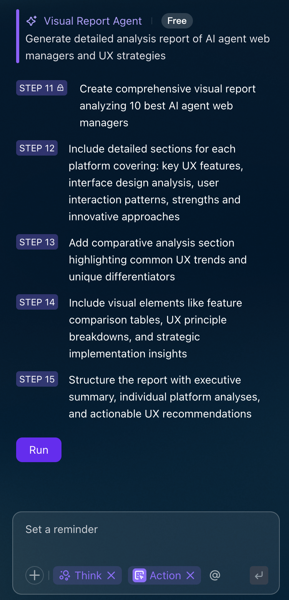

> The UX is intended to be proactive, intelligent, and human-centric, where the AI serves as a powerful collaborator rather than just a tool.

AI agent web manager should:
1. **Be transparent** - Always explain what it's doing
2. **Give control** - Let users pause, undo, or customize
3. **Learn and adapt** - Get better with each interaction
4. **Work for everyone** - Support different abilities and preferences
5. **Handle mistakes well** - Quick fixes when things go wrong

# 10 user experience if we provide ai agent product (ai agent web manager)

1. [Proactive Autonomy and Optimization](#1-proactive-autonomy-and-optimization)
2. [Adaptive Personalization and Content Strategy](#2-adaptive-personalization-and-content-strategy)
3. [Trust and Ethical Assurance](#3-trust-and-ethical-assurance)
4. [Human-AI Collaboration and Problem Solving](#4-human-ai-collaboration-and-problem-solving)
5. [Accessibility](#5-accessibility)
6. [Seamless Scalability and Integration](#6-seamless-scalability-and-integration)
7. [Cross-Platform Orchestration and Integration](#7-cross-platform-orchestration-and-integration)
8. [Predictive Insights and Strategic Foresight](#8-predictive-insights-and-strategic-foresight)
9. [Creative Co-Pilot and Ideation](#9-creative-co-pilot-and-ideation)
10. [Empowerment Through Education and Explainability](#10-empowerment-through-education-and-explainability)

## Findings

Purpose: To describe the complete user experience for a website owner or manager using our AI Agent Web Manager product. This report explains how the AI agent feels to use, the problems it solves, and the benefits it provides.

Introduction: Managing a website can be complicated and time-consuming. So we provide AI Agent Web Manager is designed to be your intelligent partner, taking over routine tasks, providing smart insights, and helping you grow your website effectively.

### [1.](#findings) Proactive Autonomy and Optimization 

> (use case 1)
> (red: no.2,5,6)

Proactively look after the site and optimize it — not just wait for problems to be reported. The AI should constantly watch what’s happening, spot issues early, and fix or improve things on its own. Over time, it should learn and adapt to make user experience smoother and more personal.

> “I want to arrive at work knowing yesterday’s problems are already gone.”

**Proactive Autonomy:**

- **Always watching and analyzing.** The AI agent observes how users move through pages (click paths), checks site speed, SEO,and watches for signs of trouble *before* users complain.
   - **Example**:
     - **Scenario**: A web manager for a recipe blog notices high bounce rates on certain pages but lacks time to investigate.
     - **Implementation**: The AI Agent Web Manager continuously tracks user click paths using tools like Hotjar integrated within its platform. It detects that users abandon a recipe page due to a confusing navigation menu. It flags this issue in a dashboard alert, showing a heatmap of where users drop off.
- **Acts on its own.** Instead of waiting for instructions, the AI can reason about what’s wrong and take steps to fix or adjust—especially for complex tasks.
   - **Example**:
     - **Scenario**: A web manager for an online bookstore struggles with broken links after a site update.
     - **Implementation**: The AI independently scans the website daily using a built-in crawler (similar to Screaming Frog). It identifies a broken link to a popular book’s page and automatically redirects it to the correct URL, notifying the manager via email with details (e.g., “Redirected /book1 to /books/new-release”).
- **Learns and adapts.** Using machine learning, the agent refines its behavior by analyzing data from users, improving its decisions as conditions change.
   - **Example**:
     - **Scenario**: A web manager for a fitness app website wants to improve user retention but isn’t sure which content resonates most.
     - **Implementation**: The AI uses machine learning to analyze user data (e.g., time spent on workout videos vs. nutrition articles) over a month. It learns that users prefer short workout videos and adapts by prioritizing similar content in the homepage carousel, updating its algorithm weekly based on new data.
- **Predicts and acts early.** The AI anticipates what users might want or run into, and presents solutions or relevant content before the user even asks — shifting from reactive to predictive.
   - **Example**:
     - **Scenario**: A web manager for a travel agency website wants to reduce cart abandonment during booking.
     - **Implementation**: The AI predicts potential drop-offs by analyzing user behavior (e.g., users pausing on the payment page). It proactively displays a pop-up with a discount code (e.g., “Save 10% if you book now!”) for users showing hesitation, based on patterns from past bookings.

**Optimization:**

- **Improve UI/UX.** The AI studies user behavior to find friction points and suggests or applies enhancements, for example better layout, smart content, or assistant chat features.
   - **Example**:
     - **Scenario**: A web manager for a SaaS company notices users struggle to find the “Sign Up” button on the homepage.
     - **Implementation**: The AI analyzes user click paths and heatmaps, identifying that the “Sign Up” button is buried in a cluttered footer. It suggests moving the button to a prominent top-right position and auto-implements the change after manager approval, adding a chatbot to guide new users.
- **Boost performance.** It spots bottlenecks (slow pages, heavy images, inefficient scripts) and fixes them to reduce load times—making users happier and helping with SEO.
   - **Example**:
     - **Scenario**: A web manager for a photography portfolio site faces complaints about slow page loads.
     - **Implementation**: The AI scans the site using tools like Google PageSpeed Insights integrated into its platform. It detects oversized images (e.g., 5MB JPEGs) and automatically compresses them to 500KB without quality loss, reducing load times from 5 seconds to 1 second.
- **SEO tuning.** The AI can choose or suggest keywords, monitor content engagement, and align pages with trending search terms to keep the site visible.
   - **Example**:
     - **Scenario**: A web manager for a pet supply store wants to rank higher for “dog toys” searches.
     - **Implementation**: The AI integrates with tools like SEMrush to analyze trending keywords and user engagement. It suggests adding “durable dog toys” to product descriptions and meta tags, then monitors click-through rates, adjusting keywords weekly to align with search trends.
- **Automated testing.** It runs tests on new features or pages regularly, catching bugs or issues before they affect users and ensuring site reliability.
   - **Example**:
     - **Scenario**: A web manager for an event ticketing platform launches a new checkout feature but worries about bugs.
     - **Implementation**: The AI runs automated tests using a framework like Selenium integrated into its system. It simulates user actions (e.g., adding tickets to the cart) and detects a bug where the payment button fails on mobile devices. The AI fixes the issue by adjusting the CSS and notifies the manager.

**Benefits for Users:**

- **Tailored experiences.** Each visitor sees content, layouts, or suggestions that match their interests and behavior.
- **Less friction.** The AI helps users reach what they need faster by smoothing navigation and removing obstacles.
- **Instant help.** Integrated chatbots or automated responses can answer questions or resolve issues quickly, reducing wait times.

Users are freed from constantly fixing technical problems. You can trust that the AI is ensuring your digital platform runs well. That way, you can focus your energy on strategic planning, content, or creative growth.

### [2.](#findings) Adaptive Personalization and Content Strategy

> (red: no.4, 5, 6,8)

It uses your data — what you do, what you like, your past — to offer content, suggestions, and interactions that are relevant to *you*. It changes as you use it, so you always see things that are helpful now. It doesn’t stay the same—it adapts.

> “Give me content drafts that already sound like me.”

**How It Works:**

* **Personalized content delivery:** The agent studies what you’ve done (your behavior, history, preferences), then shows you content, recommendations, information that you will find relevant. You can adjust settings depending on the kind of website (shop, blog, portfolio) so the personalization fits the type of site.
   - **Example**:
     - **Scenario**: A web manager for an online bookstore wants to increase sales by showing relevant book recommendations.
     - **Implementation**: The AI integrates with the website’s user database and tracks browsing history (e.g., genres viewed, books added to cart). For a user who frequently browses sci-fi novels, the AI displays recommendations like “Top 5 New Sci-Fi Releases” on the homepage. The manager customizes settings to prioritize genre-based recommendations for the e-commerce site.
* **Real-time adaptation:** As you interact (clicking, reading, giving feedback), the agent changes things right away—maybe it shows different recommendations, or tweaks layout or content so it better matches your needs at that moment.
   - **Example**:
     - **Scenario**: A web manager for a fitness blog wants to keep users engaged during their visit.
     - **Implementation**: The AI monitors user interactions in real-time using analytics tools like Mixpanel. When a user spends time reading yoga articles, the AI dynamically adjusts the sidebar to show related content (e.g., “Beginner Yoga Poses”) and simplifies the layout for mobile users. If the user clicks a feedback button (e.g., “Not interested”), the AI switches to strength-training content.
* **Proactive and conversational help:** The agent doesn’t wait until you ask. It can reach out, suggest, guide you, summarize long content, help you make choices. It is more like a helpful assistant than just a tool.
   - **Example**:
     - **Scenario**: A web manager for a travel agency website wants to reduce customer support queries.
     - **Implementation**: The AI deploys a proactive chatbot (e.g., powered by Dialogflow) that detects when a user lingers on a booking form. It initiates a conversation, saying, “Need help choosing a destination? Here’s a summary of top beach resorts.” The chatbot also summarizes long itinerary pages into bullet points to guide decisions.
* **Better engagement:** Because content is relevant, you are more interested; you stay longer, complete tasks (buy, read, contact) more often.
   - **Example**:
     - **Scenario**: A web manager for a cooking blog wants users to read more recipes and share content.
     - **Implementation**: The AI analyzes user preferences (e.g., frequent searches for vegan recipes) and curates a personalized feed, like “Vegan Dinner Ideas for You.” It also adds a “Share to Social Media” button next to popular recipes, based on engagement data.
* **Higher information quality:** The content is accurate, suitable for the domain (if site is technical, or about cooking, law, etc.), so you trust it.
   - **Example**:
     - **Scenario**: A web manager for a legal advice website needs to ensure content is accurate and relevant.
     - **Implementation**: The AI cross-references content with a trusted legal database (e.g., LexisNexis API) to ensure accuracy. For a user searching “divorce laws,” it delivers verified articles tailored to their region (e.g., “California Divorce Laws 2025”) and flags outdated content for the manager to review.
* **Building loyalty:** Over time, because the experience stays good and keeps getting better, you are more likely to come back, recommend, and stay a user.
   - **Example**:
     - **Scenario**: A web manager for an online pet store wants to retain customers.
     - **Implementation**: The AI tracks user purchase history and preferences (e.g., buying dog food monthly) and sends personalized email reminders with tailored offers (e.g., “20% off your dog’s favorite kibble”). It also adjusts the website’s homepage to highlight pet care tips based on past purchases.

**Additional Value when these Functions are Composed Together:**

* When AI combines **real-time adaptation + feedback + good recommendations**, it feels like the site knows you.
* When AI also adds adaptive interface (layout changes, style, device-friendly), the experience is smoother and comfortable.
* If you have control (preferences + privacy), you feel safe and in charge.

- **Example**:
     - **Scenario**: A web manager for a fashion e-commerce site wants to reduce cart abandonment and increase sales.
     - **Implementation**: The AI combines real-time adaptation (e.g., showing “Summer Dresses” when a user browses warm-weather clothing), feedback (e.g., user clicks “Not my style” to refine suggestions), and recommendations (e.g., “Try these sandals to match your dress”). For example, if a user abandons a cart, the AI sends a personalized email with a curated outfit based on their browsing history.
     
     - **Scenario**: A web manager for a news website wants to improve mobile user experience.
     - **Implementation**: The AI detects that 60% of users access the site on mobile and adapts the interface by increasing font size, simplifying menus, and prioritizing top stories based on user interests (e.g., sports news for sports fans). It switches to a dark mode for evening readers, based on device settings.

     - **Scenario**: A web manager for a health and wellness site wants to ensure users trust personalization features.
     - **Implementation**: The AI provides a user preference dashboard where visitors can choose what data to share (e.g., “Use my browsing history but not my location”). It also displays a privacy notice (e.g., “Your data is encrypted and not shared”) and allows users to opt out of personalization. The manager can review data usage logs to ensure GDPR compliance.

### [3.](#findings) Trust and Ethical Assurance

> (red: no.3,7,8)

These agents often handle sensitive information and make decisions on their own, so people need to feel safe before relying on them. To build this trust, the system must be open about how it works, handle data responsibly, and always meet user expectations. This makes users more satisfied, confident, and loyal over time.

It’s important to clearly explain what the agent *can* and *cannot* do, follow simple ethical rules, and give honest explanations for its choices. Users need to feel the agent is reliable, safe, and not hiding anything.

> “I need to know the AI won’t do anything shady with my data.”

**Core principles of integrity:**

1. Be honest about what the AI can and cannot do.
2. Be open about how decisions are made.
3. Be fair and admit possible risks, like mistakes or biases.

**Ways to build trust:**

- Explain in plain language how the AI agent works, where it gets its information, and how it makes decisions. This helps reduce the “black box” feeling where users don’t understand what’s happening.
   - **Example**:
     - **Scenario**: A web manager for an e-commerce site wants customers to trust AI-driven product recommendations.
     - **Implementation**: The AI displays a tooltip next to recommendations, stating, “We suggest this jacket because you viewed similar items last week. Data comes from your browsing history, stored securely.” The manager can access a dashboard explaining the AI’s logic (e.g., “Used collaborative filtering on user data”).
- Protect user data with strong privacy and security steps. Follow laws and regulations so users feel their information is safe.
   - **Example**:
     - **Scenario**: A web manager for a health coaching website handles sensitive user data like fitness goals.
     - **Implementation**: The AI uses end-to-end encryption for data transfers (e.g., between the website and a CRM like Salesforce) and complies with GDPR by minimizing data collection (e.g., only storing workout preferences, not personal health details). Users see a privacy notice: “Your data is encrypted and deleted after 90 days unless you opt in.”
- Always act with honesty, fairness, and integrity in the AI’s decisions and explanations.
   - **Example**:
     - **Scenario**: A web manager for a job board wants to ensure AI-driven job recommendations are fair.
     - **Implementation**: The AI discloses when it cannot recommend jobs due to limited data, saying, “We need more profile details to suggest relevant jobs.” It avoids making assumptions and flags potentially biased data (e.g., favoring certain demographics) for manager review.
- Give users tools to see what the AI is doing, such as dashboards or logs.
   - **Example**:
     - **Scenario**: A web manager for a news website uses the AI to moderate comments.
     - **Implementation**: The AI provides a dashboard showing moderated comments (e.g., “Removed 5 spam comments on 10/1/2025”) with reasons (e.g., “Contained offensive language”). Users can view a public log of moderation actions, summarized as, “We removed comments violating our community guidelines.”
- Let users guide or override the AI when needed so they don’t feel powerless.
   - **Example**:
     - **Scenario**: A web manager for a blog platform uses the AI to auto-publish articles.
     - **Implementation**: The AI suggests article edits (e.g., “Shorten this paragraph for clarity”) but requires manager approval before publishing. Users can opt out via a toggle: “Disable auto-edits.” The dashboard includes an “Undo” button for AI changes.
- Provide clear feedback, like notifications or simple explanations, so users know why the AI made a choice and how it affects them.
   - **Example**:
     - **Scenario**: A web manager for a travel booking site uses the AI to optimize page load times.
     - **Implementation**: When the AI compresses images to reduce load time, it notifies the manager: “Compressed 10 images to improve load time from 4s to 1s.” End-users see a banner: “We optimized this page for faster browsing based on your device.”
- Over time, show reliability by matching user expectations and behaving in a safe, predictable way.
   - **Example**:
     - **Scenario**: A web manager for an online course platform wants users to trust AI-suggested courses.
     - **Implementation**: The AI consistently recommends courses based on user progress (e.g., “Advanced Python after completing Python Basics”) and maintains 99% uptime over six months, tracked via a dashboard metric.
- Set clear limits and boundaries: explain what the AI *will* do and what it *will not* do.
   - **Example**:
     - **Scenario**: A web manager for a financial advisory site uses the AI to answer user queries.
     - **Implementation**: The AI displays a disclaimer: “I provide general financial tips but cannot offer personalized investment advice. Consult a licensed advisor for that.” It escalates complex queries to a human support team.
- Invest in user-centered visual designs (e.g., minimalist dashboards with progress indicators).
   - **Example**:
     - **Scenario**: A web manager for a charity website uses the AI to manage donations.
     - **Implementation**: The AI provides a minimalist dashboard with a progress bar (e.g., “75% of donation form optimizations complete”) and clear visuals showing data usage (e.g., “Your data is used only for donation processing”). Users see a simple interface with trust badges (e.g., “GDPR Compliant”).

> *“Black box” means a system where people cannot see or understand how it makes its decisions.*

**Principles for trust and ethics:**

1. **Transparency and explainability**
   People need to know how and why the AI acts.

   - **Simple explanations for users:** Tell them why a product was suggested or why a page layout changed.
   - **Clear internal logs:** Keep a record of the data used, the reasoning, and the action taken. This allows audits and accountability.
   - **Active updates:** Notify users when the AI makes changes, for example: *“We optimized the site for faster loading based on your internet speed.”*
   - **Example**:
      - **Scenario**: A web manager for a retail site uses the AI to personalize discounts.
      - **Implementation**: The AI explains discounts to users: “You got 15% off because you’re a frequent shopper.” It logs decisions (e.g., “Discount applied based on 5+ purchases in 2025”) and sends manager notifications: “Discounts applied to 100 users today.” The manager can audit logs via a dashboard.

2. **Human oversight**
   AI should not act completely alone. Humans must stay in control of important decisions.

   - **Escalate big decisions:** Send sensitive or risky actions to a human for approval.
   - **Governance agent:** Have a “watchdog” AI that checks other agents and flags possible ethical problems.
   - **Easy controls:** Let users stop, change, or give feedback on AI actions. Make it simple to opt out of AI-driven decisions.
   - **Example**:
      - **Scenario**: A web manager for a social media platform uses the AI to flag inappropriate posts.
      - **Implementation**: The AI flags posts for review but escalates high-risk cases (e.g., potential hate speech) to a human moderator. A governance agent monitors AI decisions, alerting the manager to anomalies (e.g., “10% increase in flagged posts”). Users can override AI flags via a “Report Error” button.

3. **Bias and fairness**
   AI can repeat unfair patterns from the data it learns. To prevent this:

   - **Check data sources:** Review the data regularly to make sure it’s fair, representative, and legal.
   - **Test fairness:** Use tests to check if results are fair for all groups of people.
   - **Diverse teams:** Build and review the system with people from different backgrounds to catch hidden biases.
   - **Example**:
      - **Scenario**: A web manager for a job search site uses the AI to recommend candidates to employers.
      - **Implementation**: The AI checks its training data (e.g., resume database) for diversity, flagging underrepresentation of certain groups. It runs fairness tests to ensure recommendations don’t favor specific demographics. A diverse development team reviews AI outputs monthly to catch biases.

4. **Data privacy and governance**
   Respect for privacy is key to trust.

   - **Clear data rules:** Explain how data is collected, stored, and used in a way anyone can understand.
   - **Strong protections:** Use encryption, minimize data collection, and restrict access to sensitive data.
   - **Follow the law:** Always comply with data protection rules like GDPR and AI-related laws that give users the right to ask for explanations.
   - **Example**:
      - **Scenario**: A web manager for an online tutoring platform handles student data.
      - **Implementation**: The AI provides a clear privacy policy: “We collect only your course preferences and delete data after 90 days.” It uses encryption and limits data access to authorized staff, complying with GDPR. Users can request data deletion via a simple form.

5. **Resilience and safety**
   The system must be safe even when things go wrong.

   - **Safety rules:** Put in place strict guardrails so the AI cannot take harmful actions.
   - **Safe failure:** If the AI is unsure, it should ask a human or give a safe fallback instead of making a risky choice.
   - **Secure design:** Protect the system from attacks where people try to trick the AI into making harmful decisions.
   - **Example**:
      - **Scenario**: A web manager for an e-commerce site uses the AI to process payments.
      - **Implementation**: The AI has guardrails preventing actions like processing invalid payments. If unsure (e.g., suspicious transaction), it escalates to a human and defaults to a safe action (e.g., holding the transaction). It uses secure APIs (e.g., Stripe) to prevent hacking attempts.

### [4.](#findings) Human-AI Collaboration and Problem Solving

> (red: no.2, 5, 6, 8)

Want both the AI and user to work together. The AI handles hard, data-heavy work; people give direction, make final decisions, and bring human insight. This teamwork makes solutions better, faster, and more reliable.

> “When something breaks I want the AI to pair-debug with me.”

**Human-AI Collaboration Models:**

- **Human-in-the-Loop:** Human review is a mandatory and integrated step in the AI's process. The AI cannot proceed without explicit human approval. Ideal for improving AI or handling nuanced tasks.
   - **Example**:
     - **Scenario**: A web manager for a news website uses the AI to moderate user comments but wants to ensure sensitive content is handled carefully.
     - **Implementation**: The AI flags potentially inappropriate comments (e.g., containing sensitive political terms) and sends them to the manager for review via a dashboard. The manager approves or rejects each flag (e.g., “Approve: Comment is constructive debate”). The AI learns from these approvals to refine future flagging.
- **Human-on-the-Loop:** The human acts as an overseer, monitoring for exceptions. The AI is trusted to handle most tasks independently.
   - **Example**:
     - **Scenario**: A web manager for an e-commerce site uses the AI to optimize product page layouts but wants to monitor major changes.
     - **Implementation**: The AI autonomously adjusts layouts (e.g., moving the “Add to Cart” button based on click data) but alerts the manager for exceptions (e.g., “Layout change reduced conversions by 5%”). The manager reviews a weekly summary on a dashboard and tweaks settings if needed.
- **Human-in-Command:** The AI functions as a tool under direct, moment-to-moment human control. The human remains the central decision-maker. Critical for ethical or high-risk scenarios.
   - **Example**:
     - **Scenario**: A web manager for a healthcare website uses the AI to update patient information pages but needs full control due to HIPAA regulations.
     - **Implementation**: The AI suggests content updates (e.g., “Add new COVID-19 guidelines”) but requires the manager to manually approve each change via a GUI. The manager uses a text-based interface to instruct the AI: “Update symptoms section with CDC data.”

**Key elements of a positive user experience:**

1. **Transparency and explainable AI**
Understanding the "why": Users need to see and understand the AI's reasoning, rather than perceiving it as a "black box". In problem-solving, this can mean an AI providing a rationale for its proposed solution.
Trust and transparency indicators: UX patterns such as "AI Notice Patterns" inform users when they are interacting with AI-generated information. This encourages critical assessment and builds trust by managing user expectations. 
- **Example**:
     - **Scenario**: A web manager for a travel booking site uses the AI to troubleshoot high bounce rates on the checkout page.
     - **Implementation**: The AI analyzes user data and suggests, “Move the payment button higher; 60% of users abandon due to navigation issues.” It displays an “AI Notice” on the dashboard: “This suggestion is based on click path analysis from 1,000 users.” The manager can view a detailed rationale (e.g., heatmap data).
2. **Control and human-in-the-loop (HITL) workflows**
Maintaining human agency: While agents can act autonomously, human managers must retain final decision-making authority for high-stakes tasks. This is often implemented via manual review or approval steps before an agent executes a significant action.
Balancing automation and oversight: The UX must allow for a smooth transition between an agent's autonomous actions and a human's intervention. Effective managers treat agents like dynamic, trainable team members whose performance and actions are routinely coached and reviewed. 
- **Example**:
     - **Scenario**: A web manager for a blog platform uses the AI to auto-schedule posts but wants to review sensitive topics.
     - **Implementation**: The AI schedules posts based on engagement data but flags sensitive topics (e.g., mental health) for manager approval. The manager uses a dashboard to review and edit posts, with an option to “Reject and Provide Feedback” (e.g., “Needs more positive tone”).
3. **Adaptive and natural interaction**
Multi-modal interfaces: The best management interfaces allow for natural interactions using a variety of modalities, such as text, speech, documents, or a graphical user interface (GUI). Users can fluidly shift between these methods.
Empathetic feedback: For multi-agent systems that may cause delays, empathetic and informative feedback helps build trust. Examples include visible status updates ("Agent Alpha is synthesizing insights...") or transparent estimated completion times (ETAs). 
- **Example**:
     - **Scenario**: A web manager for an online learning platform needs to debug a slow-loading course page.
     - **Implementation**: The AI allows the manager to interact via a GUI dashboard or voice commands (e.g., “Show me page load issues”). It provides empathetic feedback: “Analyzing page load times… ETA 30 seconds.” The AI identifies a heavy video file and suggests compression, showing a progress bar during the fix.
4. **Continuous feedback and improvement**
Feedback loops: Web managers need intuitive mechanisms to provide feedback on an agent's performance, allowing for continuous learning and refinement. This includes rating an agent's output or flagging inaccurate suggestions.
Visibility into performance: Dashboards tracking key metrics, like automated resolution rate and customer satisfaction scores, are crucial for gauging an agent's effectiveness. 
- **Example**:
     - **Scenario**: A web manager for a customer support site uses the AI to handle FAQs but wants to improve its accuracy.
     - **Implementation**: The AI tracks FAQ resolution rates (e.g., “Resolved 85% of queries”) on a dashboard and allows the manager to rate responses (e.g., “Thumbs up/down”). After the manager flags an inaccurate answer, the AI retrains to improve future responses, increasing accuracy to 90%.

### [5.](#findings) Accessibility

> (use case 6)

Accessibility creates an inclusive website experience for all users, including those with disabilities, while helping web managers meet legal requirements, boost user retention, and improve search engine rankings. By leveraging AI to detect issues, adapt interfaces, and simplify content, the agent acts as a powerful tool to make websites more usable for everyone.

**Positive user experience advancements:**

- **Adaptive interfaces:** AI agents can personalize the user experience in real-time by automatically adjusting settings like font size, color contrast, and navigation options based on individual needs or preferences.
   - **Example**:
     - **Scenario**: A web manager for a news website wants to improve readability for users with visual impairments.
     - **Implementation**: The AI detects a user with low vision (via browser settings or user profile) and increases font size to 18pt and adjusts color contrast to WCAG 2.1 standards (e.g., black text on a white background). It also simplifies navigation by reducing menu items for mobile users.
- **Natural language interfaces:** For users with motor impairments or cognitive challenges, AI agents enable hands-free navigation through voice commands. AI-powered interfaces can process spoken commands to click buttons, perform searches, and type messages.
   - **Example**:
     - **Scenario**: A web manager for an e-commerce site wants to support users with motor impairments.
     - **Implementation**: The AI integrates with a voice recognition tool (e.g., Google Cloud Speech-to-Text) to process commands like “Add this shirt to my cart” or “Search for blue jeans.” It confirms actions with audio feedback: “Shirt added to cart.”
- **Automated accessibility checks:** AI can function as an auditing tool within the web manager. Agents can continuously scan for Web Content Accessibility Guidelines (WCAG) violations, such as missing alt text or poor color contrast, and provide real-time recommendations to developers.
   - **Example**:
     - **Scenario**: A web manager for a blog platform needs to ensure WCAG compliance.
     - **Implementation**: The AI uses an integrated tool like axe DevTools to scan for missing alt text on images. It flags 50 images and suggests descriptions (e.g., “A dog playing in a park”) for manager approval via a dashboard.
- **Real-time transcription and description:** AI-powered agents can provide automated, real-time closed captions for video content and text-to-speech functionality for visual content, greatly benefiting users with hearing or visual impairments.
   - **Example**:
     - **Scenario**: A web manager for an online course platform wants to make video lectures accessible.
     - **Implementation**: The AI uses a transcription tool (e.g., AWS Transcribe) to generate real-time captions for lecture videos and converts charts to text descriptions (e.g., “Bar chart showing 2025 sales trends”). Users can toggle captions or listen to descriptions via text-to-speech.
- **Improved navigation and understanding:** AI can analyze the semantic structure of a website's code and content, making it more understandable for screen readers and other assistive technologies. This also helps with voice search optimization for users relying on AI assistants.     
   - **Example**:
     - **Scenario**: A web manager for a government website wants to improve navigation for screen reader users.
     - **Implementation**: The AI analyzes the site’s HTML and adds semantic tags (e.g., ARIA landmarks) to improve screen reader navigation. It also optimizes content for voice search (e.g., “Find tax forms”), ensuring compatibility with assistants like Alexa.

**Common user experience issues:**

- **Accuracy challenges and errors:** A primary concern is that automated accessibility tools are not flawless. AI-generated captions or image descriptions can contain inaccuracies that misrepresent information. One study noted that automated tests catch only about 30% of accessibility issues, making human testing essential.
   - **Example**:
     - **Scenario**: A web manager for a retail site uses the AI to generate video captions.
     - **Implementation**: The AI misinterprets a product name (e.g., “EcoBag” as “Echo Bag”) in captions. The manager reviews flagged inaccuracies via a dashboard and corrects them manually.
- **Lack of transparency and trust:** Many AI systems operate as "black boxes," leaving users to wonder how decisions were made. If an agent's autonomous actions are confusing or produce errors, user trust can plummet. Managers need clear, transparent explanations and reliable feedback mechanisms built into the interface.
   - **Example**:
     - **Scenario**: A web manager for a charity site uses the AI to adjust color contrast.
     - **Implementation**: The AI changes contrast without explanation, confusing users. The manager adds a notification: “Contrast adjusted for low-vision users based on WCAG standards.”
- **Bias in training data:** If the data used to train AI agents is not diverse, the models can fail to recognize and address the needs of certain disability groups. This leads to an incomplete or biased approach to accessibility that can exclude users.
   - **Example**:
     - **Scenario**: A web manager for a job board uses the AI to simplify content for cognitive accessibility.
     - **Implementation**: The AI, trained on limited data, fails to simplify complex job descriptions for neurodiverse users. The manager retrains the AI with diverse datasets, including inputs from neurodiverse testers.
- **Steep learning curve for managers:** The management interface itself can be complex, with numerous customization options that disrupt the user's workflow. This is especially problematic for non-technical users who may find it challenging to configure agents properly.
   - **Example**:
     - **Scenario**: A non-technical web manager for a small business site struggles to configure accessibility settings.
     - **Implementation**: The AI’s interface has too many options. The manager uses a guided setup wizard with tooltips (e.g., “Enable alt text suggestions for images”) to configure settings.
- **Risk of over-reliance on automation:** Companies may become overly dependent on automated AI tools and neglect fundamental human-centered design principles. Experts warn that AI should be a supporting tool, not a replacement for thoughtful design and human oversight, including manual testing with disabled users.
   - **Example**:
     - **Scenario**: A web manager for a university website relies solely on AI for accessibility fixes.
     - **Implementation**: The AI misses nuanced issues (e.g., unclear form labels for screen readers). The manager schedules quarterly audits with disabled users to validate AI fixes.
- **Limited scope of accessibility needs:** Many AI solutions focus on common accessibility issues like visual and auditory impairments but may neglect more complex cognitive or motor disabilities. This creates a risk of addressing a narrow range of needs while leaving many users behind.
   - **Example**:
     - **Scenario**: A web manager for a community forum overlooks cognitive accessibility.
     - **Implementation**: The AI prioritizes visual fixes (e.g., contrast) but misses complex text. The manager retrains the AI to simplify content (e.g., bullet points for neurodiverse users) using diverse datasets.

**Best practices for improving user experience:**

For a successful universal accessibility experience, AI agent web managers should:
- **Prioritize transparency:** Show users how the AI makes decisions and provide clear system status updates, progress bars, and feedback notifications.
   - **Example**:
      - **Scenario**: A web manager for a retail site uses the AI to add alt text to images.
- **Empower user control:** Give users the option to override or correct an AI's actions. This builds trust and ensures the user always feels in control.
   - **Example**:
      - **Scenario**: A web manager for a travel blog uses the AI to adjust font sizes.
- **Maintain human oversight:** Combine automated AI testing with manual audits by human experts, especially involving users with disabilities. This helps catch errors and biases that automated tools might miss.
   - **Example**:
      - **Scenario**: A web manager for an e-learning platform ensures video accessibility.
- **Leverage diverse data:** Ensure AI is trained on a variety of diverse and representative datasets to reduce bias and better address a broader spectrum of user needs.
   - **Example**:
      - **Scenario**: A web manager for a government site wants to support cognitive disabilities.
- **Design for simplicity:** Create an intuitive and clean management interface, with features and configurations presented simply to avoid overwhelming users.
   - **Example**:
      - **Scenario**: A web manager for a non-technical web manager for a small business site configures accessibility.
- **Provide guidance and feedback loops:** Offer guided interactions and clear documentation to help users understand the agent's full capabilities. Incorporate user feedback mechanisms to continuously improve the agent's performance.
   - **Example**:
      - **Scenario**: A web manager for a forum site improves AI caption accuracy.

### [6.](#findings) Seamless Scalability and Integration

> (red: no.4,7,8)

using multi-agent frameworks implementing robust orchestration and communication tools for efficient multi-agent coordination, and leveraging predictive and real-time adaptation capabilities for dynamic response and proactive task management. Integration with external tools and digital interfaces is also key, allowing agents to access and utilize various systems to complete complex tasks effectively and provide a comprehensive, context-aware experience.

**How seamless scalability and integration enhance the user experience:**

1. **For web and product managers:**

- **Intuitive workflow management:** Managers can visually configure and connect AI agents to different tools, simplifying the automation of complex workflows without needing extensive coding.
   - **Example**:
     - **Scenario**: A web manager for a small e-commerce store wants to automate inventory updates across their website and supplier database.
- **Centralized control and governance:** A single, centralized platform offers clear visibility into how AI agents are being used. This makes it easier to monitor performance, enforce compliance, and reduce security risks as the system expands.
   - **Example**:
     - **Scenario**: A web manager for a travel booking platform oversees multiple AI agents handling bookings, support, and analytics.
- **Faster time-to-market:** By leveraging pre-built agents and templates, or using low-code/no-code platforms, managers can quickly deploy and test new AI functionalities, responding faster to market changes and customer needs.
   - **Example**:
     - **Scenario**: A web manager for a fitness app wants to launch a chatbot to answer user questions about workouts.
- **Data-driven insights:** Integrated AI agents can aggregate and analyze user interaction data from across platforms to provide granular insights into customer behavior. This helps managers make better decisions about product roadmaps and feature prioritization. 
   - **Example**:
     - **Scenario**: A web manager for a blog platform wants to prioritize content based on user behavior.
     - **Implementation**: The AI integrates with Google Analytics and a CRM to analyze user data (e.g., most-read topics, click-through rates). It suggests focusing on “healthy recipes” content, showing a report: “50% of users engage with healthy eating posts.”

2. **For end-users:**

- **Proactive and personalized experiences:** Agents can use real-time data from various sources (like CRMs or support tickets) to offer highly personalized and context-aware responses. For example, a support bot can access past customer history to resolve issues more efficiently.
- **Consistent, reliable service:** With a scalable architecture, agents can handle increased workloads and fluctuating demand without compromising on response time or performance. This prevents slowdowns and ensures reliable service during peak usage.
- **Reduced cognitive load:** By automating complex multi-step tasks, AI agents simplify the user journey. Consistent and clear user interfaces ensure that users don't have to guess what an agent means, reducing frustration and confusion.
- **24/7 availability:** Integrated AI agents can provide instant, automated support at any time. This allows users to get immediate answers to common questions without needing to wait for a human agent.
- **Seamless cross-platform functionality:** Scalable agents can operate consistently across multiple channels, such as web, mobile apps, and voice assistants. This provides a unified brand experience for users, no matter which device they use.

**Best practices for a seamless experience:**

To ensure a positive user experience, web managers should follow these best practices for scaling and integrating AI agents:
- Start with narrow, high-value use cases to prove the agent's value before scaling to more complex tasks.
- Standardize communication protocols and data formats across all agents and the user interface to ensure smooth data flow and reduce errors.
- Leverage cloud-native architecture for flexible, dynamic resource allocation that can scale seamlessly with demand.
- Implement a robust agent orchestration layer to manage and coordinate agents working across different systems.
- Prioritize a "human-in-the-loop" model for critical or complex decisions, ensuring a smooth handoff from the agent to a human agent when necessary.
- Use comprehensive monitoring tools and establish clear performance benchmarks (KPIs) to track agent behavior, analyze token usage, and identify bottlenecks. 

### [7.](#findings) Cross-Platform Orchestration and Integration

> (red: no.4)

includes a single interface where several AI agents, tools, and data sources work together to automate difficult processes and produce smooth, effective, and context-aware answers. The AI agent web manager simplifies workflows, cuts down on delays, and provides users with faster, more accurate information and decision-making by coordinating several specialized agents into a single, user-friendly platform. 

> “Update data on web and mobile at the same time.”
> “When I publish a new product drop, I want the AI to coordinate the whole launch—web, shop, email, socials, analytics—so nothing falls through the cracks.”

**Core concepts:**

- **AI Agent:** An autonomous AI entity designed to perform specific, specialized tasks with minimal human intervention. Examples include chatbots, data analysis bots, or agents that interface with external APIs.
   - **Example**:
     - **Scenario**: A web manager for an online retail store needs to handle customer inquiries across platforms.
     - **Implementation**: The AI Agent Web Manager deploys a chatbot agent (e.g., powered by Dialogflow) to answer FAQs on the website and a data analysis agent to track inventory levels via a Shopify API. The chatbot responds to queries like “Is this jacket in stock?” using real-time data from the analysis agent.
- **AI Orchestration:** The centralized process of coordinating and managing multiple AI agents and workflows to work together effectively toward a common goal. It handles task delegation, data flow, resource optimization, and conflict resolution.
   - **Example**:
     - **Scenario**: A web manager for a travel agency launches a new tour package across web, mobile, and social media.
     - **Implementation**: The AI’s orchestration layer (e.g., built on CrewAI) coordinates a content agent (writes tour descriptions), a scheduler agent (posts to web and social media), and an analytics agent (tracks engagement). It resolves conflicts (e.g., scheduling overlaps) and ensures consistent messaging.
- **Cross-Platform Integration:** The ability for an AI agent or orchestrated system to operate consistently across different environments, such as a website, mobile app, cloud service, or on-premises system. It involves integrating various APIs, databases, and other systems. 
   - **Example**:
     - **Scenario**: A web manager for a fitness app syncs user workout data across web, mobile, and smartwatches.
     - **Implementation**: The AI integrates with APIs for the web platform, mobile app (e.g., React Native), and smartwatch (e.g., Fitbit API), ensuring workout logs (e.g., “Ran 5km”) sync instantly across all devices.

**Benefits for User Experience:**

- Simplicity and Ease of Use: Users can make requests through one interface, with the system acting as a central hub to find and utilize the most relevant information and tools. **Implementation**: The AI provides a single interface (e.g., a dashboard) where the manager enters, “Publish breaking news about election results.” The AI coordinates agents to update the website, mobile app, and Twitter, pulling data from a news API (e.g., NewsAPI).
- Streamlined Task Automation: Complex processes and tasks can be automated by having different AI agents collaborate to complete them, rather than requiring manual interaction with each system. **Implementation**: The AI orchestrates a product agent (updates Shopify inventory), a marketing agent (sends emails via Mailchimp), and a social media agent (posts to Instagram). The manager triggers the launch with one command: “Launch new sneakers.”
- Increased Productivity: By eliminating delays and improving the flow of work between agents and platforms, overall productivity is boosted. **Implementation**: The AI coordinates an onboarding agent (guides users via website), a CRM agent (updates Salesforce profiles), and an analytics agent (tracks onboarding success via Google Analytics). It eliminates delays by syncing data in real-time.
- Faster and More Accurate Decisions: Faster access to consolidated information from various sources leads to more precise and timely decision-making for users. **Implementation**: The AI integrates data from Shopify (inventory), Google Analytics (demand), and a pricing API (e.g., Pricefx) to suggest dynamic pricing (e.g., “Lower price by 10% due to high demand”). The manager approves via a dashboard.
- Reduced Errors: Integration and coordination minimize the chances of errors that can occur when humans manually switch between multiple systems. **Implementation**: The AI coordinates a content agent (updates WordPress) and a social media agent (posts to Twitter) via a unified API, ensuring no scheduling conflicts (e.g., duplicate posts). It logs actions for audit.

**Examples:**

1. **More capable and coherent interactions:** Instead of a single, general-purpose AI, an orchestrated system can assemble a "crew" of specialized agents to handle different parts of a complex user request. For example, in a customer service scenario:
    - A natural language agent recognizes the user's intent.
    - A knowledge retrieval agent finds the right information from a company knowledge base.
    - A sentiment analysis agent detects frustration and escalates the query to a human if necessary.
2. **Seamless omnichannel experience:** Users experience consistent service regardless of the touchpoint—be it a web chat, mobile app, or social media message. Orchestration ensures the AI agents have a unified view of customer data and conversation history to provide personalized and relevant support across all channels.
3. **Real-time personalization and responsiveness:** Orchestrated agents can analyze real-time data from a user's interactions and preferences to provide highly customized experiences. In e-commerce, this can translate to instant, personalized product recommendations and pricing adjustments based on real-time inventory and demand data.
4. **Proactive assistance and automation:** An orchestrated system can move beyond simple, reactive responses. For example, an HR agent could proactively offer a knowledge base article based on a user's typed query, or an IT agent could automate a password reset upon recognizing a user's frustration.
5. **Faster task completion and efficiency:** By dividing a complex task among multiple specialized agents, orchestration significantly speeds up task resolution. This reduces user wait times and frustration, boosting overall customer satisfaction.
6. **Continuous improvement and learning:** A centralized web manager can monitor and analyze interactions to continuously improve the agents' performance. This allows the AI system to learn and adapt over time, offering more accurate and relevant responses with each user interaction.

**How it could work:**
A single orchestration brain sits inside the AI Web Manager.
It owns a real-time map of every connected channel (website, mobile app, Shopify, SAP, Salesforce, social, email, cloud drives, on-prem DB).
When a user types “Launch new product drop,” the brain:
- spins up specialist AI agents (inventory, pricing, copywriter, designer, scheduler),
- gives them shared context (brand voice, stock level, legal rules),
- streams progress events back to the user in one chat thread,
- commits atomic transactions to each external system,
- stores an immutable log for audit.

**Examples of Platforms and Tools:**

- [CrewAI](https://www.crewai.com/): A multi-agent platform that allows users to build and deploy automated workflows using different LLMs and cloud platforms. 
- AutoGen and [Langchain](https://www.langchain.com/): Frameworks that facilitate multi-agent systems by providing orchestration capabilities for interacting agents. 
- A2A Protocol: An open-source protocol developed by [Google Cloud](https://cloud.google.com/discover/what-are-ai-agents) that makes AI agents interoperable across various platforms and infrastructures. 

### [8.](#findings) Predictive Insights and Strategic Foresight

> (use case 2, 3, 5, 6)
> (red: no.5, 8)

Using predictive insights to anticipate user needs and strategic foresight to proactively guide users, ultimately leading to a more personalized, efficient, and proactive platform. This is achieved through a web manager that integrates these AI capabilities to analyze user data, predict behavior, suggest relevant actions, and automate processes, resulting in a seamless and intelligent user journey within the web environment.

> “Show me where revenue will be in 90 days so I can adjust spend now.”

**How Predictive Insights Enhance User Experience:**

- Anticipating Needs: Predictive analytics, powered by machine learning algorithms trained on historical data, can identify patterns in user behavior to predict future actions, needs, or problems. 
   - **Example**:
     - **Scenario**: A web manager for an e-commerce clothing store wants to reduce cart abandonment.
     - **Implementation**: The AI uses machine learning (e.g., trained on Google Analytics data) to predict which users are likely to abandon their carts based on patterns like pausing on the checkout page. It proactively offers a pop-up discount (e.g., “Complete your purchase for 10% off!”) to those users.
- Personalized Content & Offers: The AI agent can use these predictions to deliver tailored content, products, or recommendations, making the user's experience more relevant and engaging. 
   - **Example**:
     - **Scenario**: A web manager for a streaming service wants to increase viewer retention.
     - **Implementation**: The AI analyzes viewing history (e.g., via Netflix-like algorithms) and predicts user preferences (e.g., favoring sci-fi shows). It recommends tailored playlists (e.g., “Top Sci-Fi Series for You”) on the homepage.
- Proactive Support: By predicting potential issues, the agent can offer solutions before the user even encounters a problem, improving satisfaction and reducing frustration. 
   - **Example**:
     - **Scenario**: A web manager for a SaaS platform wants to reduce support tickets for login issues.
     - **Implementation**: The AI predicts login failures by analyzing patterns (e.g., multiple failed attempts) and proactively sends a password reset link via email before the user contacts support. It integrates with an identity management system (e.g., Okta).

**How Strategic Foresight Enhances User Experience:**

- Proactive Guidance: Beyond immediate predictions, strategic foresight allows the AI agent to look further ahead, guiding users towards goals or opportunities they might not have considered. 
   - **Example**:
     - **Scenario**: A web manager for a financial advisory site wants to help users plan investments.
     - **Implementation**: The AI uses foresight models (e.g., trained on market trends via Bloomberg API) to suggest, “Based on current trends, investing in renewable energy ETFs could yield 8% returns in 12 months.” It guides users to a long-term investment planner tool.
- Automated Workflows: Foresight helps the agent to identify inefficiencies and automate repetitive tasks or entire workflows, streamlining user interactions with the web manager. 
   - **Example**:
     - **Scenario**: A web manager for a blog platform wants to streamline content publishing.
     - **Implementation**: The AI identifies inefficiencies (e.g., manual scheduling delays) and automates the workflow by coordinating content creation (via a content agent), SEO optimization (via SEMrush integration), and scheduling (via WordPress API). It predicts peak engagement times for posting.
- Optimized Processes: The agent can use foresight to suggest the most efficient paths for users to complete tasks, allocate resources effectively, and ensure operations run smoothly. 
   - **Example**:
     - **Scenario**: A web manager for an e-commerce site optimizes ad spend during a holiday sale.
     - **Implementation**: The AI uses foresight to analyze past sales data and predict high-traffic days (e.g., Black Friday). It suggests allocating 60% of ad budget to Google Ads for maximum ROI, integrating with Google Ads API for real-time adjustments.

**How Predictive Insights and Strategic Foresight Work:**
- Data Analysis: The manager continuously collects and analyzes user interaction data from the website or platform. 
   - **Example**:
     - **Scenario**: A web manager for a travel booking site wants to understand user preferences.
     - **Implementation**: The AI collects data from website clicks, searches (e.g., “beach vacations”), and bookings via Google Analytics and a CRM. It compiles a report showing 70% of users prefer tropical destinations in winter.
- Pattern Recognition: AI models identify trends, preferences, and potential future actions based on this data. 
   - **Example**:
     - **Scenario**: A web manager for a retail site notices a sudden drop in traffic.
     - **Implementation**: The AI detects an anomaly (e.g., “30% traffic drop on homepage”) and sends an alert: “Possible SEO issue; check broken links.” It visualizes the drop on a dashboard graph, linking to a diagnostic tool (e.g., Screaming Frog).
- Prediction & Foresight: The system then predicts what a user might do next or what challenges they might face. 
   - **Example**:
     - **Scenario**: A web manager for a news site wants to reduce subscriber churn.
     - **Implementation**: The AI predicts churn risk for users who haven’t engaged in 30 days and suggests sending a personalized email (e.g., “Missed our latest stories? Here’s a curated list!”) via Mailchimp integration.
- Action & Guidance: The AI agent takes action, such as offering a timely product recommendation, resolving a potential issue, or suggesting a more efficient way to complete a task. 
   - **Example**:
     - **Scenario**: A web manager for a retail site tracks AI performance in content updates.
     - **Implementation**: The AI’s dashboard shows metrics: “98% of articles updated on schedule, average update time: 10 seconds.” It flags slow performance (e.g., “API delay detected”) and suggests optimizations (e.g., “Switch to faster API”).
- Continuous Learning: The agent improves its predictions and foresight through ongoing learning, creating a dynamic and adaptive user experience. 
   - **Example**:
     - **Scenario**: A web manager for a news site improves content recommendations.
     - **Implementation**: The AI tracks user engagement (e.g., “60% of users click on recommended articles”) and uses user feedback (e.g., “Thumbs down for irrelevant content”) to retrain the model, improving accuracy to 75%.

### [9.](#findings) Creative Co-Pilot and Ideation

> (use case 2, 4)

a "Creative Co-Pilot" for ideation can be implemented to act as an intuitive assistant and collaborative partner. These agents function as collaborative partners, assisting with tasks like brainstorming, content generation, and refinement.

Users can feel overwhelmed or disempowered by fully automated creative processes. They value the ability to guide, edit, and refine the AI's output.

The interface should reinforce that the human is in control. For example, use transparent, editable outputs that can be treated as first drafts rather than final products. Integrate user feedback mechanisms (e.g., upvotes, downvotes, or ratings) to refine the AI's suggestions over time.

> “I want to brainstorm new ideas without being overwhelmed by AI’s suggestions.”

**How:**

- Allow users to define the purpose and personality of their AI agents using natural language. For instance, a user could task an agent with "market research for a new product launch" and specify a creative or analytical approach.
- The user sees the co-pilot as a writing partner that handles the tedious task of getting words on a page. This allows them to focus on higher-level storytelling, brand messaging, and creative refinement. The Human-in-the-Loop (HITL) process ensures the final output retains a human touch and meets quality standards.

**Core components for the Creative Co-Pilot:**

1. Intelligent ideation catalyst
    - Generate diverse ideas: The co-pilot can create multiple, unexpected ideas or concepts based on user inputs. Instead of just brainstorming, it can act as a sketching partner that provides rapid variations to accelerate the creative process.
      - **Example**:
        - **Scenario**: A web manager for a lifestyle blog needs fresh content ideas for a summer campaign.
        - **Implementation**: The manager inputs, “Generate ideas for summer wellness content” into the AI’s interface (e.g., powered by a tool like Jasper AI). The AI suggests diverse ideas: “5 Beach Yoga Routines,” “Healthy Summer Smoothie Recipes,” and “Mindfulness Tips for Vacations.” The manager selects and refines ideas via an editable dashboard.
    - Challenge assumptions: By analyzing industry norms and a brand's established patterns, the co-pilot can introduce disruptive suggestions that encourage users to think outside the box and question ingrained processes.
      - **Example**:
        - **Scenario**: A web manager for an e-commerce fashion site wants to differentiate their brand’s marketing.
        - **Implementation**: The AI analyzes competitors (e.g., via SEMrush) and the brand’s Instagram posts, identifying a trend of minimalist ads. It suggests a bold campaign: “Launch a vibrant, retro-themed campaign to stand out.” The manager reviews the suggestion with a rationale: “Retro themes increased engagement by 30% in similar industries.”
    - Incorporate cross-disciplinary insights: It can spark fresh ideas by drawing connections and merging concepts from different fields, helping users break through creative blocks.
      - **Example**:
        - **Scenario**: A web manager for a tech startup’s blog struggles with repetitive content.
        - **Implementation**: The AI, trained on diverse datasets (e.g., via Langchain), combines tech trends with psychology insights, suggesting a blog post: “How Gamification Boosts User Engagement in SaaS Apps.” It provides a draft outline merging game design and user behavior concepts.

2. Collaborative interface design
    - Immersive or assistive models: The user interface (UI) can be designed to either be the main interaction screen for ideation (immersive) or a side panel that assists with ongoing tasks (assistive). This choice depends on the complexity of the task and the user's primary focus.
      - **Example**:
        - **Scenario**: A web manager for a tech startup’s blog struggles with repetitive content.
        - **Implementation**: The AI, trained on diverse datasets (e.g., via Langchain), combines tech trends with psychology insights, suggesting a blog post: “How Gamification Boosts User Engagement in SaaS Apps.” It provides a draft outline merging game design and user behavior concepts.
    - Intuitive input and output: Instead of a single text field, a more user-centric design would break long prompts into smaller, guided steps. Outputs should be treated as editable, transparent drafts, not final products. Users should be able to see the generated content, track its origin, and make revisions.
      - **Example**:
        - **Scenario**: A web manager for a non-profit needs a fundraising campaign email.
        - **Implementation**: The AI guides the manager through steps (e.g., “Choose tone: Inspiring or Urgent,” “Select audience: Donors or Volunteers”). It generates an editable draft: “Help us change lives!” with a source note: “Based on your brand’s positive tone.” The manager revises via a text editor.
    - Human-in-command principle: The UX design must reinforce that the human is the "pilot." This is achieved through transparent language (e.g., "Summarize with co-pilot") and clear controls that let users guide and edit the AI's output.
      - **Example**:
        - **Scenario**: A web manager for a restaurant website needs social media posts.
        - **Implementation**: The AI suggests posts (e.g., “Try our new summer menu!”) with a label: “Generated by Co-Pilot.” The manager uses a dashboard with “Edit,” “Approve,” or “Reject” buttons and provides feedback (e.g., “Add more casual tone”). The AI refines future suggestions.

Platforms and tools like Canva AI and various blog topic generators implement this approach, offering features to turn rough concepts into editable designs, generate high-quality blogs in a brand's voice, and provide real-time recommendations. This partnership between humans and AI is seen as a way to enhance creativity and drive innovation by combining AI's analytical power with human ingenuity.

### [10.](#findings) Empowerment Through Education and Explainability

> (red: no.7)

The AI agent transforms from a simple tool into a mentor that actively builds user expertise. Rather than creating dependency, the system is designed to make users more knowledgeable and self-sufficient. Each interaction becomes a learning opportunity, clearer complex concepts and empowering users to make better strategic decisions.

> “I want to learn why the AI did that so I can do it myself next time.”

**Educational interventions:**

- **Guided tutorials:** Interactive tutorials or "in-app help" guide users through complex features or concepts, building confidence as they complete tasks.
   - **Example**:
     - **Scenario**: A non-technical web manager for a small e-commerce site needs to set up AI-driven product recommendations.
     - **Implementation**: The AI provides an in-app tutorial with step-by-step prompts (e.g., “Step 1: Connect to Shopify API” with a clickable button). A video walkthrough explains how recommendations work, and a “Try It” feature lets the manager test settings in a sandbox environment.
- **Explainable AI (XAI):** Use XAI to highlight decisions and provide step-by-step explanations for AI actions. Users can review reasoning, adjust parameters, and troubleshoot if needed.
   - **Example**:
     - **Scenario**: A web manager for a blog platform wants to understand why the AI prioritized certain articles.
     - **Implementation**: The AI explains its decision in a dashboard: “Prioritized ‘Healthy Recipes’ due to 40% higher click-through rate last week.” It breaks down the reasoning (e.g., “Analyzed Google Analytics data, user demographics”) and allows the manager to adjust parameters (e.g., “Focus on fitness content”).
- **Feedback mechanisms:** Provide feedback to users that identifies improvements, explaining why changes are beneficial and how to optimize performance. This builds a pattern of continuous improvement and understanding.
   - **Example**:
     - **Scenario**: A web manager for a SaaS website uses the AI to optimize landing page conversions.
     - **Implementation**: After the AI suggests moving the “Sign Up” button, it provides feedback: “This change increased conversions by 15% because it’s more visible.” The manager can rate the suggestion (e.g., “Helpful”) to refine future AI outputs.

**Predictive insights features:**

- **Predictive scoring and forecasting:** The manager's dashboard provides predictive scores and forecasts on trends like customer churn or sales revenue. The UX challenge lies in presenting these complex outputs clearly, with understandable confidence intervals and actionable recommendations.
   - **Example**:
     - **Scenario**: A web manager for an online course platform wants to predict subscriber churn.
     - **Implementation**: The AI’s dashboard shows a churn score: “20% risk for 500 users, based on 30-day inactivity.” It includes a confidence interval (e.g., 95%) and recommends sending re-engagement emails via Mailchimp integration. A graph visualizes trends.
- **Anomaly detection:** Anomaly detection capabilities highlight potential issues or opportunities that would otherwise be missed. Users interact with real-time alerts and visualizations that show deviations from normal performance metrics.
   - **Example**:
     - **Scenario**: A web manager for a retail site notices a sudden drop in traffic.
     - **Implementation**: The AI detects an anomaly (e.g., “30% traffic drop on homepage”) and sends an alert: “Possible SEO issue; check broken links.” It visualizes the drop on a dashboard graph, linking to a diagnostic tool (e.g., Screaming Frog).
- **Performance monitoring:** AI agents continuously analyze their own performance and report on areas for improvement. The UI provides dashboards and reports on task completion rates, speed, and accuracy, helping managers optimize agent deployment.
   - **Example**:
     - **Scenario**: A web manager for a news site tracks AI performance in content updates.
     - **Implementation**: The AI’s dashboard shows metrics: “98% of articles updated on schedule, average update time: 10 seconds.” It flags slow performance (e.g., “API delay detected”) and suggests optimizations (e.g., “Switch to faster API”).

**Strategic foresight features:**

- **Scenario modeling:** AI agents can rapidly run "what-if" scenarios, helping to evaluate different strategic options and their likely outcomes. The user experience involves setting parameters and then reviewing the simulated results through data visualizations and narrative summaries.
   - **Example**:
     - **Scenario**: A web manager for an e-commerce site plans a holiday marketing budget.
     - **Implementation**: The AI runs scenarios (e.g., “What if we allocate 70% to Google Ads vs. 70% to Instagram?”) using a forecasting tool (e.g., Prophet). It shows a visualization: “Google Ads yields 20% higher ROI.” A summary explains: “Google Ads targets high-intent users.”
- **Automated horizon scanning:** The AI performs continuous environmental scanning and trend analysis across vast amounts of data, identifying emerging trends and potential market disruptions. The manager's UI might show a dynamic map of emerging signals or categorize them into different themes.
   - **Example**:
     - **Scenario**: A web manager for a tech blog wants to stay ahead of industry trends.
     - **Implementation**: The AI scans tech news and social media (e.g., via NewsAPI, Twitter API) and identifies a trend: “AI-powered wearables gaining traction.” It displays a dynamic map on the dashboard, categorizing themes like “Health Tech” and “Privacy Concerns.”
- **Contextualized narrative generation:** Using large language models (LLMs), agents can generate coherent narratives explaining complex data and potential future scenarios. This helps managers communicate strategic insights to stakeholders, turning raw data into an understandable story. 
   - **Example**:
     - **Scenario**: A web manager for a retail chain needs to present a sales strategy to stakeholders.
     - **Implementation**: The AI (e.g., using an LLM like GPT-4) analyzes sales data and generates a narrative: “Investing in eco-friendly products could increase sales by 10% due to rising consumer demand.” It includes a slide deck with charts for stakeholder meetings.

---

<video width="100%" controls>
  <source src="./public/1.mp4" type="video/mp4">
  Your browser does not support the video tag.
</video>

---

#### articles 

- [How to design experiences for AI agents](https://www.uxdesigninstitute.com/blog/design-experiences-for-ai-agents/)
- [What is accessible design](https://www.uxdesigninstitute.com/blog/what-is-accessible-design/)
- [How to design for AI-first products](https://www.uxdesigninstitute.com/blog/how-to-design-for-ai-first-products/)
- [Building AI-First Products](https://community.ibm.com/community/user/blogs/anuj-bahuguna/2025/05/01/building-ai-first-products-a-new-paradigm-in-uxd)
    - Google's former CEO, "AI-first means we're rethinking all our products and applying machine learning and AI to solve user problems."
    - Research from Accenture reveals that 83% of consumers are willing to share their data for a more customized experience.
    - Renowned usability expert, suggests that "AI interfaces should make capabilities obvious without requiring users to guess what the system can do."
    - AI researcher emphasizes, "The key is to set up the infrastructure to continuously collect data and feed it back to the algorithm to make the system better."
    - users trust AI systems more when they understand how decisions are being made and can override them when necessary.
- [Agentic AI Products 2025](https://www.ibm.com/downloads/documents/us-en/137a1e23d85ba699)

#### ai agent reviews

- [manus ai review](https://www.technologyreview.com/2025/03/11/1113133/manus-ai-review/)
- [clear path to building your first ai agent](https://www.reddit.com/r/AgentsOfAI/comments/1mwof0j/building_your_first_ai_agent_a_clear_path/)
- [dont build multi agents](https://cognition.ai/blog/dont-build-multi-agents#a-theory-of-building-long-running-agents)

#### UX

- [3. Trust & Ethical Assurance](https://www.sciencedirect.com/science/article/pii/S2444569X25001155)
- [4. Human-AI Collaboration and Problem Solving](https://www.researchgate.net/publication/395582948_AI_Agents_with_Human-Like_Collaborative_Tools_Adaptive_Strategies_for_Enhanced_Problem-Solving)
- [5. Universal Accessibility](https://www.uxtigers.com/post/ai-agents)
- [7. Cross-Platform Orchestration](https://madgicx.com/blog/cross-platform-ai-orchestration) | [7. Cross-Platform Orchestration](https://www.ibm.com/think/topics/ai-agent-orchestration)