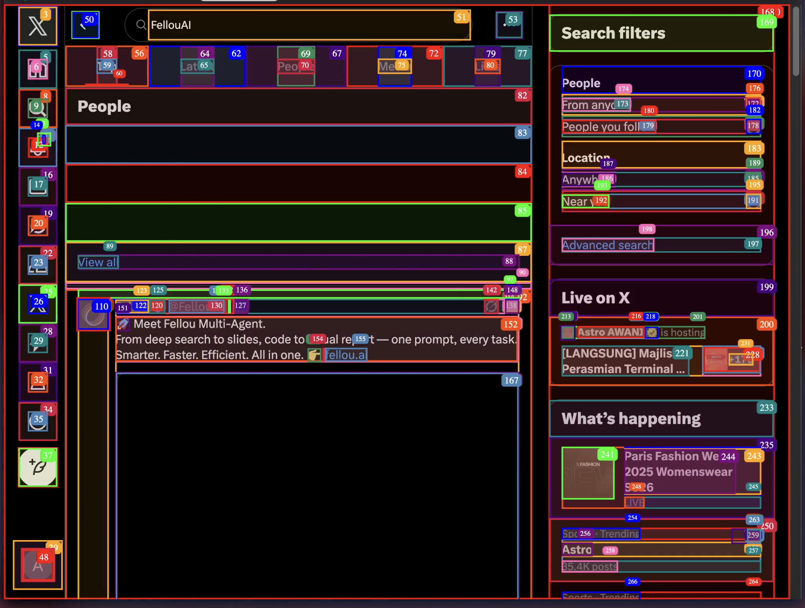

> The UX is intended to be proactive, intelligent, and human-centric, where the AI serves as a powerful collaborator rather than just a tool.

# 10 user experience if we provide ai agent product (ai agent web manager)

1. [Proactive Autonomy and Optimization](#1-proactive-autonomy-and-optimization)
2. [Adaptive Personalization and Content Strategy](#2-adaptive-personalization-and-content-strategy)
3. [Trust and Ethical Assurance](#3-trust-and-ethical-assurance)
4. [Human-AI Collaboration and Problem Solving](#4-human-ai-collaboration-and-problem-solving)
5. [Accessibility](#5-accessibility)
6. [Seamless Scalability and Integration](#6-seamless-scalability-and-integration)
7. [Cross-Platform Orchestration and Integration](#7-cross-platform-orchestration-and-integration)
8. [Predictive Insights and Strategic Foresight](#8-predictive-insights-and-strategic-foresight)
9. [Creative Co-Pilot and Ideation](#9-creative-co-pilot-and-ideation)
10. [Empowerment Through Education and Explainability](#10-empowerment-through-education-and-explainability)

## Findings

Purpose: To describe the complete user experience for a website owner or manager using our AI Agent Web Manager product. This report explains how the AI agent feels to use, the problems it solves, and the benefits it provides.

Introduction: Managing a website can be complicated and time-consuming. So we provide AI Agent Web Manager is designed to be your intelligent partner, taking over routine tasks, providing smart insights, and helping you grow your website effectively.

### [1.](#findings) Proactive Autonomy and Optimization

Proactively look after the site and optimize it — not just wait for problems to be reported. The AI should constantly watch what’s happening, spot issues early, and fix or improve things on its own. Over time, it should learn and adapt to make user experience smoother and more personal.

**Proactive Autonomy:**
- Continuous monitoring and analysis: AI agents actively observe user interactions, track click paths, and monitor site speed to identify potential issues before users report them. 
- Independent decision-making: Unlike human assistants, AI agents can independently reason, decide, and act to resolve issues, handling complex workflows without needing further prompts. 
- Learning and adaptation: Through machine learning, agents continuously refine their performance by evaluating user data and adapting their strategies to maintain effectiveness in dynamic environments. 
- Anticipatory action: By predicting user needs and outcomes, AI agents can proactively deliver information and tailored experiences, shifting from a reactive to a predictive interaction model.

**Optimization:**
- User experience (UX) improvements: AI agents analyze user behavior to provide insights for improved UI/UX design and can implement features like personalized content or chatbots to improve engagement.
- Performance enhancement: They identify and resolve bottlenecks, leading to faster site load times, which improves user satisfaction and can positively impact search engine rankings.
- SEO optimization: AI agents can automatically optimize SEO for pages, suggest relevant keywords based on trends, and analyze content engagement to recommend improvements.
- Automated testing: Agents can perform regular, thorough tests on new functionalities to catch bugs and glitches before they impact users, ensuring site stability.

**Benefits for Users:**
- Personalized and seamless interactions: Users encounter content and layouts tailored to their preferences, creating a delightful and relevant browsing experience. 
- Reduced friction: By identifying pain points and optimizing navigation, agents help users find information and complete tasks more efficiently. 
- Faster, more efficient support: Chatbots and automated responses can provide immediate assistance for user inquiries, reducing waiting times. 

**The User Benefit:** This pillar liberates the user from the relentless cycle of technical debt. It instills a profound sense of confidence that the foundational integrity and performance of their digital asset are perpetually maintained, allowing them to redirect their energy toward business strategy and creative growth.

### [2.](#findings) Adaptive Personalization and Content Strategy

Deliver personalized, real-time content and interactions through Adaptive Personalization and Content Strategy within an AI Agent Web Manager. The AI agent analyzes user data (behavior, preferences, history) to understand needs and then tailors content, recommendations, and interactions to be relevant and engaging, improving satisfaction, and efficiency. This creates a dynamic, adaptive experience where the content and the interaction itself evolve based on user feedback and real-time context. 

**How:**

- Personalized Content Delivery: By analyzing user data, AI agents can provide tailored content, recommendations, and information, making the user experience more relevant and valuable. Ensure the AI adapts to different website types (e.g., e-commerce, portfolios) by offering customizable settings for each consideration.
- Real-time Adaptation: The AI agent can adapt its responses, content, and interface in real-time based on user interactions, feedback, and context. 
- Proactive and Conversational Support: AI agents can go beyond scripted responses to offer proactive help, summarize information, and guide users through decisions, fostering customer satisfaction and loyalty.
- Enhanced Engagement: Personalized and relevant content leads to increased user engagement, leading to better task completion rates and overall satisfaction. 
- Improved Information Quality: By retrieving domain-specific knowledge, AI agents can ensure the accuracy and relevance of the information provided, boosting the quality of the user's experience. 
- Building Loyalty: A consistently positive and relevant experience fosters customer loyalty by giving users what they need in a helpful and intuitive way. 

Here’s a rewritten version in much simpler, easy-to-read English. I kept it long, clear, and without jargon, while combining things that repeated:

---

### [3.](#findings) Building Trust and Acting Ethically

Trust is one of the biggest challenges when people use AI agents for web management. These agents often handle sensitive information and make decisions on their own, so people need to feel safe before relying on them. To build this trust, the system must be open about how it works, handle data responsibly, and always meet user expectations. This makes users more satisfied, confident, and loyal over time.

It’s important to clearly explain what the agent *can* and *cannot* do, follow simple ethical rules, and give honest explanations for its choices. Users need to feel the agent is reliable, safe, and not hiding anything.

**Core principles of integrity:**

1. Be honest about what the system can and cannot do.
2. Be open about how decisions are made.
3. Be fair and admit possible risks, like mistakes or biases.

**Ways to build trust:**

- Explain in plain language how the AI agent works, where it gets its information, and how it makes decisions. This helps reduce the “black box” feeling where users don’t understand what’s happening.
- Protect user data with strong privacy and security steps. Follow laws and regulations so users feel their information is safe.
- Always act with honesty, fairness, and integrity in the AI’s decisions and explanations.
- Give users tools to see what the AI is doing, such as dashboards or logs.
- Let users guide or override the AI when needed so they don’t feel powerless.
- Provide clear feedback, like notifications or simple explanations, so users know why the AI made a choice and how it affects them.
- Over time, show reliability by matching user expectations and behaving in a safe, predictable way.
- Set clear limits and boundaries: explain what the AI *will* do and what it *will not* do.
- Invest in user-centered visual designs (e.g., minimalist dashboards with progress indicators).

> *“Black box” means a system where people cannot see or understand how it makes its decisions.*

**Principles for trust and ethics:**

1. **Transparency and explainability**
   People need to know how and why the AI acts.

   - **Simple explanations for users:** Tell them why a product was suggested or why a page layout changed.
   - **Clear internal logs:** Keep a record of the data used, the reasoning, and the action taken. This allows audits and accountability.
   - **Active updates:** Notify users when the AI makes changes, for example: *“We optimized the site for faster loading based on your internet speed.”*

2. **Human oversight**
   AI should not act completely alone. Humans must stay in control of important decisions.

   - **Escalate big decisions:** Send sensitive or risky actions to a human for approval.
   - **Governance agent:** Have a “watchdog” AI that checks other agents and flags possible ethical problems.
   - **Easy controls:** Let users stop, change, or give feedback on AI actions. Make it simple to opt out of AI-driven decisions.

3. **Bias and fairness**
   AI can repeat unfair patterns from the data it learns. To prevent this:

   - **Check data sources:** Review the data regularly to make sure it’s fair, representative, and legal.
   - **Test fairness:** Use tests to check if results are fair for all groups of people.
   - **Diverse teams:** Build and review the system with people from different backgrounds to catch hidden biases.

4. **Data privacy and governance**
   Respect for privacy is key to trust.

   - **Clear data rules:** Explain how data is collected, stored, and used in a way anyone can understand.
   - **Strong protections:** Use encryption, minimize data collection, and restrict access to sensitive data.
   - **Follow the law:** Always comply with data protection rules like GDPR and AI-related laws that give users the right to ask for explanations.

5. **Resilience and safety**
   The system must be safe even when things go wrong.

   - **Safety rules:** Put in place strict guardrails so the AI cannot take harmful actions.
   - **Safe failure:** If the AI is unsure, it should ask a human or give a safe fallback instead of making a risky choice.
   - **Secure design:** Protect the system from attacks where people try to trick the AI into making harmful decisions.

### [4.](#findings) Human-AI Collaboration and Problem Solving

Improve efficiency and decision-making through AI agents handling complex tasks and humans providing oversight and strategic direction. Key user experience factors include AI's perceived usefulness and reliability, clear roles in the Human-in-the-Loop or Human-in-Command models, and seamless integration into familiar work environments. Designing AI agents with human-like collaborative tools and ensuring access to comprehensive data enhances problem-solving capabilities and user satisfaction.

**Human-AI Collaboration Models:**

- **Human-in-the-Loop:** Human review is a mandatory and integrated step in the AI's process. The AI cannot proceed without explicit human approval. Ideal for improving AI or handling nuanced tasks.
- **Human-on-the-Loop:** The human acts as an overseer, monitoring for exceptions. The AI is trusted to handle most tasks independently.
- **Human-in-Command:** The AI functions as a tool under direct, moment-to-moment human control. The human remains the central decision-maker. Critical for ethical or high-risk scenarios.

**Key elements of a positive user experience:**

1. **Transparency and explainable AI (XAI)**
Understanding the "why": Users need to see and understand the AI's reasoning, rather than perceiving it as a "black box". In problem-solving, this can mean an AI providing a rationale for its proposed solution.
Trust and transparency indicators: UX patterns such as "AI Notice Patterns" inform users when they are interacting with AI-generated information. This encourages critical assessment and builds trust by managing user expectations. 
2. **Control and human-in-the-loop (HITL) workflows**
Maintaining human agency: While agents can act autonomously, human managers must retain final decision-making authority for high-stakes tasks. This is often implemented via manual review or approval steps before an agent executes a significant action.
Balancing automation and oversight: The UX must allow for a smooth transition between an agent's autonomous actions and a human's intervention. Effective managers treat agents like dynamic, trainable team members whose performance and actions are routinely coached and reviewed. 
3. **Adaptive and natural interaction**
Multi-modal interfaces: The best management interfaces allow for natural interactions using a variety of modalities, such as text, speech, documents, or a graphical user interface (GUI). Users can fluidly shift between these methods.
Empathetic feedback: For multi-agent systems that may cause delays, empathetic and informative feedback helps build trust. Examples include visible status updates ("Agent Alpha is synthesizing insights...") or transparent estimated completion times (ETAs). 
4. **Continuous feedback and improvement**
Feedback loops: Web managers need intuitive mechanisms to provide feedback on an agent's performance, allowing for continuous learning and refinement. This includes rating an agent's output or flagging inaccurate suggestions.
Visibility into performance: Dashboards tracking key metrics, like automated resolution rate and customer satisfaction scores, are crucial for gauging an agent's effectiveness. 

### [5.](#findings) Accessibility

Accessibility creates an inclusive website experience for all users, including those with disabilities, while helping web managers meet legal requirements, boost user retention, and improve search engine rankings. By leveraging AI to detect issues, adapt interfaces, and simplify content, the agent acts as a powerful tool to make websites more usable for everyone.

**Positive user experience advancements:**

- **Adaptive interfaces:** AI agents can personalize the user experience in real-time by automatically adjusting settings like font size, color contrast, and navigation options based on individual needs or preferences.
- **Natural language interfaces:** For users with motor impairments or cognitive challenges, AI agents enable hands-free navigation through voice commands. AI-powered interfaces can process spoken commands to click buttons, perform searches, and type messages.
- **Automated accessibility checks:** AI can function as an auditing tool within the web manager. Agents can continuously scan for Web Content Accessibility Guidelines (WCAG) violations, such as missing alt text or poor color contrast, and provide real-time recommendations to developers.
- **Real-time transcription and description:** AI-powered agents can provide automated, real-time closed captions for video content and text-to-speech functionality for visual content, greatly benefiting users with hearing or visual impairments.
- **Improved navigation and understanding:** AI can analyze the semantic structure of a website's code and content, making it more understandable for screen readers and other assistive technologies. This also helps with voice search optimization for users relying on AI assistants.     

**Common user experience issues:**

- **Accuracy challenges and errors:** A primary concern is that automated accessibility tools are not flawless. AI-generated captions or image descriptions can contain inaccuracies that misrepresent information. One study noted that automated tests catch only about 30% of accessibility issues, making human testing essential.
- **Lack of transparency and trust:** Many AI systems operate as "black boxes," leaving users to wonder how decisions were made. If an agent's autonomous actions are confusing or produce errors, user trust can plummet. Managers need clear, transparent explanations and reliable feedback mechanisms built into the interface.
- **Bias in training data:** If the data used to train AI agents is not diverse, the models can fail to recognize and address the needs of certain disability groups. This leads to an incomplete or biased approach to accessibility that can exclude users.
- **Steep learning curve for managers:** The management interface itself can be complex, with numerous customization options that disrupt the user's workflow. This is especially problematic for non-technical users who may find it challenging to configure agents properly.
- **Risk of over-reliance on automation:** Companies may become overly dependent on automated AI tools and neglect fundamental human-centered design principles. Experts warn that AI should be a supporting tool, not a replacement for thoughtful design and human oversight, including manual testing with disabled users.
- **Limited scope of accessibility needs:** Many AI solutions focus on common accessibility issues like visual and auditory impairments but may neglect more complex cognitive or motor disabilities. This creates a risk of addressing a narrow range of needs while leaving many users behind.

**Best practices for improving user experience:**

For a successful universal accessibility experience, AI agent web managers should:
- **Prioritize transparency:** Show users how the AI makes decisions and provide clear system status updates, progress bars, and feedback notifications.
- **Empower user control:** Give users the option to override or correct an AI's actions. This builds trust and ensures the user always feels in control.
- **Maintain human oversight:** Combine automated AI testing with manual audits by human experts, especially involving users with disabilities. This helps catch errors and biases that automated tools might miss.
- **Leverage diverse data:** Ensure AI is trained on a variety of diverse and representative datasets to reduce bias and better address a broader spectrum of user needs.
- **Design for simplicity:** Create an intuitive and clean management interface, with features and configurations presented simply to avoid overwhelming users.
- **Provide guidance and feedback loops:** Offer guided interactions and clear documentation to help users understand the agent's full capabilities. Incorporate user feedback mechanisms to continuously improve the agent's performance.

### [6.](#findings) Seamless Scalability and Integration

using multi-agent frameworks implementing robust orchestration and communication tools for efficient multi-agent coordination, and leveraging predictive and real-time adaptation capabilities for dynamic response and proactive task management. Integration with external tools and digital interfaces is also key, allowing agents to access and utilize various systems to complete complex tasks effectively and provide a comprehensive, context-aware experience.

**How seamless scalability and integration enhance the user experience:**

1. **For web and product managers:**

- **Intuitive workflow management:** Managers can visually configure and connect AI agents to different tools, simplifying the automation of complex workflows without needing extensive coding.
- **Centralized control and governance:** A single, centralized platform offers clear visibility into how AI agents are being used. This makes it easier to monitor performance, enforce compliance, and reduce security risks as the system expands.
- **Faster time-to-market:** By leveraging pre-built agents and templates, or using low-code/no-code platforms, managers can quickly deploy and test new AI functionalities, responding faster to market changes and customer needs.
- **Data-driven insights:** Integrated AI agents can aggregate and analyze user interaction data from across platforms to provide granular insights into customer behavior. This helps managers make better decisions about product roadmaps and feature prioritization. 

2. **For end-users:**

- **Proactive and personalized experiences:** Agents can use real-time data from various sources (like CRMs or support tickets) to offer highly personalized and context-aware responses. For example, a support bot can access past customer history to resolve issues more efficiently.
- **Consistent, reliable service:** With a scalable architecture, agents can handle increased workloads and fluctuating demand without compromising on response time or performance. This prevents slowdowns and ensures reliable service during peak usage.
- **Reduced cognitive load:** By automating complex multi-step tasks, AI agents simplify the user journey. Consistent and clear user interfaces ensure that users don't have to guess what an agent means, reducing frustration and confusion.
- **24/7 availability:** Integrated AI agents can provide instant, automated support at any time. This allows users to get immediate answers to common questions without needing to wait for a human agent.
- **Seamless cross-platform functionality:** Scalable agents can operate consistently across multiple channels, such as web, mobile apps, and voice assistants. This provides a unified brand experience for users, no matter which device they use.

**Best practices for a seamless experience:**

To ensure a positive user experience, web managers should follow these best practices for scaling and integrating AI agents:
- Start with narrow, high-value use cases to prove the agent's value before scaling to more complex tasks.
- Standardize communication protocols and data formats across all agents and the user interface to ensure smooth data flow and reduce errors.
- Leverage cloud-native architecture for flexible, dynamic resource allocation that can scale seamlessly with demand.
- Implement a robust agent orchestration layer to manage and coordinate agents working across different systems.
- Prioritize a "human-in-the-loop" model for critical or complex decisions, ensuring a smooth handoff from the agent to a human agent when necessary.
- Use comprehensive monitoring tools and establish clear performance benchmarks (KPIs) to track agent behavior, analyze token usage, and identify bottlenecks. 

### [7.](#findings) Cross-Platform Orchestration and Integration

includes a single interface where several AI agents, tools, and data sources work together to automate difficult processes and produce smooth, effective, and context-aware answers. The AI agent web manager simplifies workflows, cuts down on delays, and provides users with faster, more accurate information and decision-making by coordinating several specialized agents into a single, user-friendly platform. 

**Core concepts:**

- **AI Agent:** An autonomous AI entity designed to perform specific, specialized tasks with minimal human intervention. Examples include chatbots, data analysis bots, or agents that interface with external APIs.
- **AI Orchestration:** The centralized process of coordinating and managing multiple AI agents and workflows to work together effectively toward a common goal. It handles task delegation, data flow, resource optimization, and conflict resolution.
- **Cross-Platform Integration:** The ability for an AI agent or orchestrated system to operate consistently across different environments, such as a website, mobile app, cloud service, or on-premises system. It involves integrating various APIs, databases, and other systems. 

**Benefits for User Experience:**

- Simplicity and Ease of Use: Users can make requests through one interface, with the system acting as a central hub to find and utilize the most relevant information and tools. 
- Streamlined Task Automation: Complex processes and tasks can be automated by having different AI agents collaborate to complete them, rather than requiring manual interaction with each system. 
- Increased Productivity: By eliminating delays and improving the flow of work between agents and platforms, overall productivity is boosted. 
- Faster and More Accurate Decisions: Faster access to consolidated information from various sources leads to more precise and timely decision-making for users. 
- Reduced Errors: Integration and coordination minimize the chances of errors that can occur when humans manually switch between multiple systems. 

**Benefits:**

1. **More capable and coherent interactions:** Instead of a single, general-purpose AI, an orchestrated system can assemble a "crew" of specialized agents to handle different parts of a complex user request. For example, in a customer service scenario:
    - A natural language agent recognizes the user's intent.
    - A knowledge retrieval agent finds the right information from a company knowledge base.
    - A sentiment analysis agent detects frustration and escalates the query to a human if necessary.
2. **Seamless omnichannel experience:** Users experience consistent service regardless of the touchpoint—be it a web chat, mobile app, or social media message. Orchestration ensures the AI agents have a unified view of customer data and conversation history to provide personalized and relevant support across all channels.
3. **Real-time personalization and responsiveness:** Orchestrated agents can analyze real-time data from a user's interactions and preferences to provide highly customized experiences. In e-commerce, this can translate to instant, personalized product recommendations and pricing adjustments based on real-time inventory and demand data.
4. **Proactive assistance and automation:** An orchestrated system can move beyond simple, reactive responses. For example, an HR agent could proactively offer a knowledge base article based on a user's typed query, or an IT agent could automate a password reset upon recognizing a user's frustration.
5. **Faster task completion and efficiency:** By dividing a complex task among multiple specialized agents, orchestration significantly speeds up task resolution. This reduces user wait times and frustration, boosting overall customer satisfaction.
6. **Continuous improvement and learning:** A centralized web manager can monitor and analyze interactions to continuously improve the agents' performance. This allows the AI system to learn and adapt over time, offering more accurate and relevant responses with each user interaction.

**Examples of Platforms and Tools:**

- [CrewAI](https://www.crewai.com/): A multi-agent platform that allows users to build and deploy automated workflows using different LLMs and cloud platforms. 
- AutoGen and [Langchain](https://www.langchain.com/): Frameworks that facilitate multi-agent systems by providing orchestration capabilities for interacting agents. 
- A2A Protocol: An open-source protocol developed by [Google Cloud](https://cloud.google.com/discover/what-are-ai-agents) that makes AI agents interoperable across various platforms and infrastructures. 

### [8.](#findings) Predictive Insights and Strategic Foresight

Using predictive insights to anticipate user needs and strategic foresight to proactively guide users, ultimately leading to a more personalized, efficient, and proactive platform. This is achieved through a web manager that integrates these AI capabilities to analyze user data, predict behavior, suggest relevant actions, and automate processes, resulting in a seamless and intelligent user journey within the web environment.

**How Predictive Insights Enhance User Experience:**

- Anticipating Needs: Predictive analytics, powered by machine learning algorithms trained on historical data, can identify patterns in user behavior to predict future actions, needs, or problems. 
- Personalized Content & Offers: The AI agent can use these predictions to deliver tailored content, products, or recommendations, making the user's experience more relevant and engaging. 
- Proactive Support: By predicting potential issues, the agent can offer solutions before the user even encounters a problem, improving satisfaction and reducing frustration. 

**How Strategic Foresight Enhances User Experience:**

- Proactive Guidance: Beyond immediate predictions, strategic foresight allows the AI agent to look further ahead, guiding users towards goals or opportunities they might not have considered. 
- Automated Workflows: Foresight helps the agent to identify inefficiencies and automate repetitive tasks or entire workflows, streamlining user interactions with the web manager. 
- Optimized Processes: The agent can use foresight to suggest the most efficient paths for users to complete tasks, allocate resources effectively, and ensure operations run smoothly. 

**How Predictive Insights and Strategic Foresight Work:**
- Data Analysis: The manager continuously collects and analyzes user interaction data from the website or platform. 
- Pattern Recognition: AI models identify trends, preferences, and potential future actions based on this data. 
- Prediction & Foresight: The system then predicts what a user might do next or what challenges they might face. 
- Action & Guidance: The AI agent takes action, such as offering a timely product recommendation, resolving a potential issue, or suggesting a more efficient way to complete a task. 
- Continuous Learning: The agent improves its predictions and foresight through ongoing learning, creating a dynamic and adaptive user experience. 

### [9.](#findings) Creative Co-Pilot and Ideation

a "Creative Co-Pilot" for ideation can be implemented to act as an intuitive assistant and collaborative partner. These agents function as collaborative partners, assisting with tasks like brainstorming, content generation, and refinement.

Users can feel overwhelmed or disempowered by fully automated creative processes. They value the ability to guide, edit, and refine the AI's output.

The interface should reinforce that the human is in control. For example, use transparent, editable outputs that can be treated as first drafts rather than final products. Integrate user feedback mechanisms (e.g., upvotes, downvotes, or ratings) to refine the AI's suggestions over time.

**How:**

- Allow users to define the purpose and personality of their AI agents using natural language. For instance, a user could task an agent with "market research for a new product launch" and specify a creative or analytical approach.
- The user sees the co-pilot as a writing partner that handles the tedious task of getting words on a page. This allows them to focus on higher-level storytelling, brand messaging, and creative refinement. The Human-in-the-Loop (HITL) process ensures the final output retains a human touch and meets quality standards.

**Core components for the Creative Co-Pilot:**

1. Intelligent ideation catalyst
    - Generate diverse ideas: The co-pilot can create multiple, unexpected ideas or concepts based on user inputs. Instead of just brainstorming, it can act as a sketching partner that provides rapid variations to accelerate the creative process.
    - Challenge assumptions: By analyzing industry norms and a brand's established patterns, the co-pilot can introduce disruptive suggestions that encourage users to think outside the box and question ingrained processes.
    - Incorporate cross-disciplinary insights: It can spark fresh ideas by drawing connections and merging concepts from different fields, helping users break through creative blocks.

2. Collaborative interface design
    - Immersive or assistive models: The user interface (UI) can be designed to either be the main interaction screen for ideation (immersive) or a side panel that assists with ongoing tasks (assistive). This choice depends on the complexity of the task and the user's primary focus.
    - Intuitive input and output: Instead of a single text field, a more user-centric design would break long prompts into smaller, guided steps. Outputs should be treated as editable, transparent drafts, not final products. Users should be able to see the generated content, track its origin, and make revisions.
    - Human-in-command principle: The UX design must reinforce that the human is the "pilot." This is achieved through transparent language (e.g., "Summarize with co-pilot") and clear controls that let users guide and edit the AI's output.

Platforms and tools like Canva AI and various blog topic generators implement this approach, offering features to turn rough concepts into editable designs, generate high-quality blogs in a brand's voice, and provide real-time recommendations. This partnership between humans and AI is seen as a way to enhance creativity and drive innovation by combining AI's analytical power with human ingenuity.

### [10.](#findings) Empowerment Through Education and Explainability

The AI agent transforms from a simple tool into a mentor that actively builds user expertise. Rather than creating dependency, the system is designed to make users more knowledgeable and self-sufficient. Each interaction becomes a learning opportunity, clearer complex concepts and empowering users to make better strategic decisions.

**Educational interventions:**

- **Guided tutorials:** Interactive tutorials or "in-app help" guide users through complex features or concepts, building confidence as they complete tasks.
- **Explainable AI (XAI):** Use XAI to highlight decisions and provide step-by-step explanations for AI actions. Users can review reasoning, adjust parameters, and troubleshoot if needed.
- **Feedback mechanisms:** Provide feedback to users that identifies improvements, explaining why changes are beneficial and how to optimize performance. This builds a pattern of continuous improvement and understanding.

**Predictive insights features:**

- **Predictive scoring and forecasting:** The manager's dashboard provides predictive scores and forecasts on trends like customer churn or sales revenue. The UX challenge lies in presenting these complex outputs clearly, with understandable confidence intervals and actionable recommendations.
- **Anomaly detection:** Anomaly detection capabilities highlight potential issues or opportunities that would otherwise be missed. Users interact with real-time alerts and visualizations that show deviations from normal performance metrics.
- **Performance monitoring:** AI agents continuously analyze their own performance and report on areas for improvement. The UI provides dashboards and reports on task completion rates, speed, and accuracy, helping managers optimize agent deployment.

**Strategic foresight features:**

- **Scenario modeling:** AI agents can rapidly run "what-if" scenarios, helping to evaluate different strategic options and their likely outcomes. The user experience involves setting parameters and then reviewing the simulated results through data visualizations and narrative summaries.
- **Automated horizon scanning:** The AI performs continuous environmental scanning and trend analysis across vast amounts of data, identifying emerging trends and potential market disruptions. The manager's UI might show a dynamic map of emerging signals or categorize them into different themes.
- **Contextualized narrative generation:** Using large language models (LLMs), agents can generate coherent narratives explaining complex data and potential future scenarios. This helps managers communicate strategic insights to stakeholders, turning raw data into an understandable story. 

---

